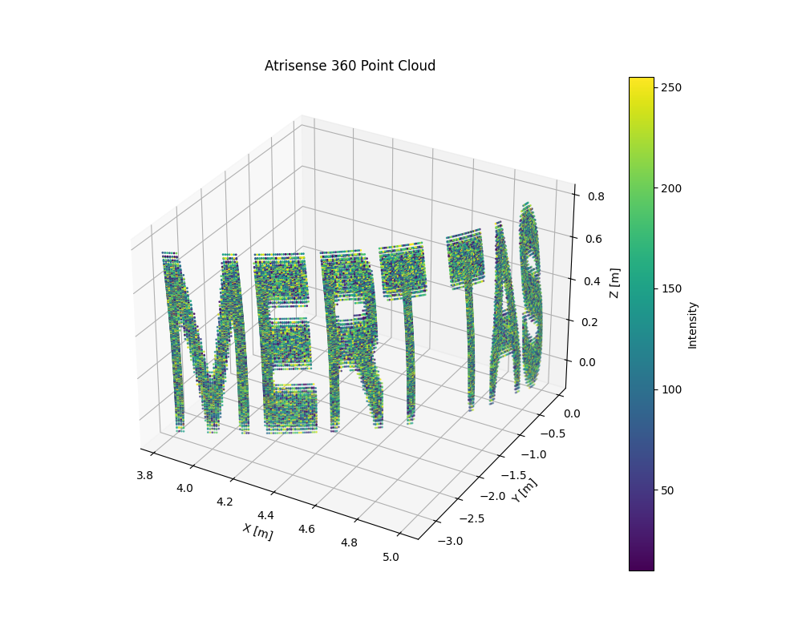

# Atrisense 360 Lidar Binary Decoder

Binary-Decoder is a lightweight Python tool for decoding binary sensor data and converting it into Cartesian coordinates. The project is designed with testability, CI support, and production readiness in mind.

This repository contains a production-ready Python implementation for decoding and visualizing binary data generated by the fictional **Atrisense 360 lidar sensor**.

The solution:
- Decodes raw binary records into structured data
- Converts spherical coordinates to Cartesian (x, y, z)
- Exports the result as a standard **PLY point cloud**
- Visualizes the point cloud using **matplotlib**

---

✨ Features

- Binary file decoding into structured records
- Conversion from polar/spherical data to Cartesian coordinates
- Robust unit test coverage using pytest
- GitHub Actions CI pipeline (runs tests on every push & PR)
- CI-safe file handling and package structure

📁 Project Structure

BinaryDecoder/
├── binary_decoder/
│ ├── __init__.py
│ └── BinaryDecoder.py
├── tests/
│ └── test_decoder.py
├── .github/workflows/
│ └── python-ci.yml
├── pytest.ini
├── requirements.txt
└── README.md
---

🚀 Getting Started

1️⃣ Clone the repository
```
git clone <repository-url>
cd BinaryDecoder
```
2️⃣ Create and activate a virtual environment
```
python -m venv venv
source venv/bin/activate  # Linux / macOS
venv\\Scripts\\activate     # Windows
```
3️⃣ Install dependencies
`pip install -r requirements.txt`

---

🧪 Running Tests

Unit tests are written using pytest and can be run locally or via CI.

`pytest`

Tests:

- Validate binary decoding
- Verify Cartesian conversion correctness
- Handle edge cases (file paths, data consistency)
- All tests are CI-safe and independent of the working directory.
---

🔄 Continuous Integration

This project uses GitHub Actions to automatically run unit tests on:
- Every push
- Every pull request

The workflow is defined in:
`.github/workflows/python-ci.yml`  
This ensures regressions are caught early and the codebase remains stable.

## Data Format

Each record in the binary file is decoded using the following C++ structure:

```cpp
struct AtrisenseRecord {
    uint32_t scan_number;
    float    x_angle_deg;
    float    y_angle_deg;
    float    distance_m;
    uint16_t intensity;
};
```

- Binary encoding: little-endian
- Record size: 18 bytes
- Input file contains 33,576 records

---

## Coordinate Conversion

Each record is converted from spherical to Cartesian coordinates using the conversion formula:  
	x = d · cos(y) · cos(x)    
	y = d · cos(y) · sin(x)      
	z = d · sin(y)      
	
Angles are converted from degrees to radians before conversion.

---

## Requirements
`pip install -r requirements.txt`

Required libraries:
- Python 3.9+
- numpy
- matplotlib

---

## How to run

1. Place the binary file "atrisense.bin" next to the script.
2. Run the decoder
	`python BinaryDecoder.py`
   
This will:
- Decode all records
- Convert them to Cartesian coordinates
- Export a PLY file:
	atrisense_pointcloud.ply
- Display a 3D visualization using matplotlib

---

## Visualization Preview

Below is a preview of the decoded Atrisense 360 LiDAR point cloud rendered using matplotlib:



---

## Output

- atrisense_pointcloud.ply — Point cloud in standard PLY format
- decoded_image.png — Screenshot of the 3D visualization

---

🧠 Design Notes

- The decoder is implemented as a proper Python package
- Imports are explicit and environment-independent
- Test data paths are resolved using pathlib
- Validation logic can be enabled without breaking the main pipeline

These choices reflect production-oriented engineering practices.

📌 Notes

- Basic input validation is applied (invalid distances are skipped)
- The solution is structured for readability and testability
- Unit tests are primarily for validation and CI, not visualization
- The project can be easily extended with performance or fuzz tests


### Validation

The correctness of the coordinate conversion was verified by

- Visualization of the resulting point cloud in 3D with matplotlib

- Numerical validation by reconstructing the distance from the Cartesian coordinates 
and comparing it with the original measured distance using a tolerance-based check to 
account for floating-point precision.

- A tolerance-based numerical validation step is included to verify the Cartesian conversion 
against the original sensor distances.


## Author

Mert Taş  
Software Developer  
mert.tas@gmail.com  

---


